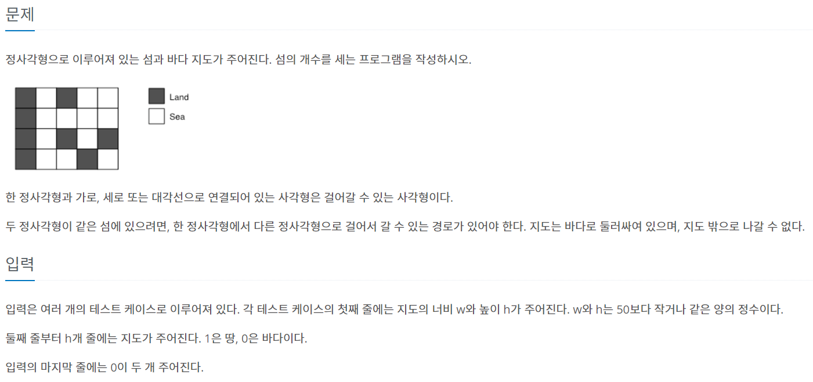



[**백준 4963번**](https://www.acmicpc.net/problem/4963){:target="_blank"}

~~~python
import sys
sys.setrecursionlimit(10000)
input = sys.stdin.readline

dx = [1,-1,0,0,1,-1,1,-1]
dy = [0,0,1,-1,1,-1,-1,1]

def dfs(i,j):
    for k in range(8):
        nx = i + dx[k]
        ny = j + dy[k]
        if nx<0 or ny<0 or nx>N-1 or ny>M-1:
            continue
        if maps[nx][ny]==0:
            continue
        maps[nx][ny]=0
        dfs(nx,ny)
    return

answer = []

while True:
    M,N = map(int,input().split())
    if N==0 and M==0:
        break
    maps = [list(map(int,input().split())) for _ in range(N)]
    count = 0
    for i in range(N):
        for j in range(M):
            if maps[i][j]==1:
                maps[i][j]=0
                dfs(i,j)
                count+=1
    answer.append(count)

for i in answer:
    print(i)
~~~