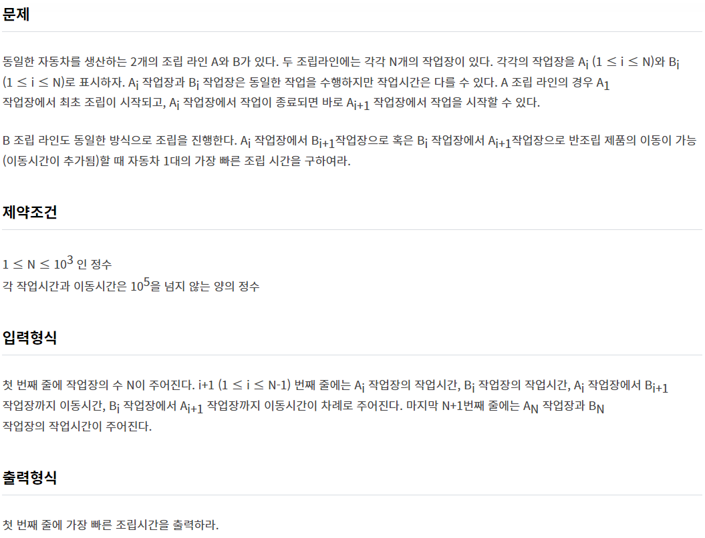



[**소프티어 조립라인**](https://softeer.ai/practice/info.do?idx=1&eid=403){:target="_blank"}

~~~python
import sys
input = sys.stdin.readline

N = int(input())
assembly = [list(map(int, input().split())) for _ in range(N)] 

d = [[0,0] for _ in range(N)]
d[0] = [assembly[0][0], assembly[0][1]]

for i in range(1, N):
    d[i] = [min(d[i-1][0], d[i-1][1] + assembly[i-1][3]) + assembly[i][0],
             min(d[i-1][1], d[i-1][0] + assembly[i-1][2]) + assembly[i][1]]

print(min(d[N-1]))
~~~