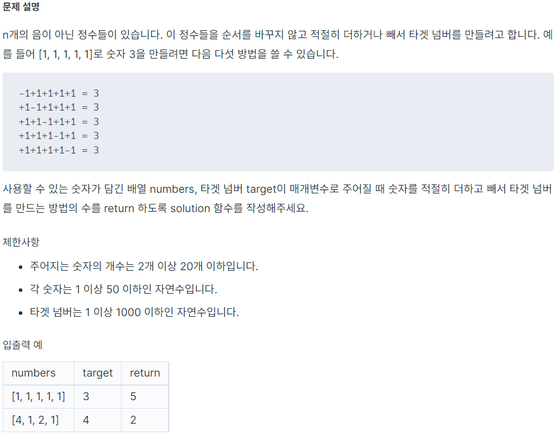



~~~python
from collections import deque

def solution(numbers, target):
    answer = 0
    queue = deque([[0, 0]])
    while queue:
        accum, idx = queue.popleft()

        if idx == len(numbers):
            if accum == target:
                answer += 1

        else:
            num = numbers[idx]
            queue.append([accum - num, idx + 1])
            queue.append([accum + num, idx + 1])

    return answer
~~~