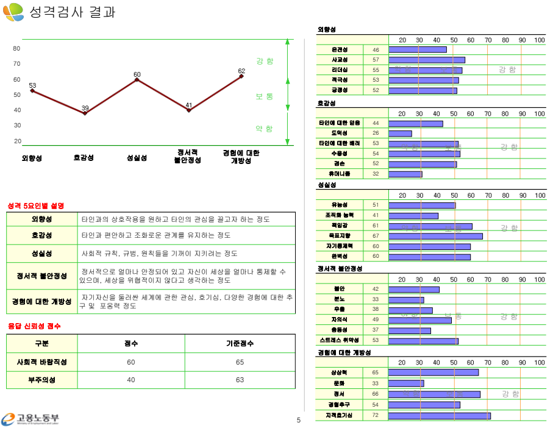
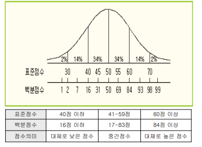
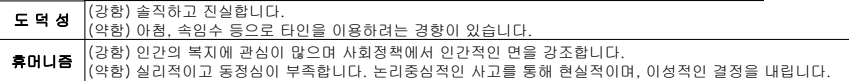

#첫 포스팅

오늘은 [**워크넷**](https://work.go.kr)에 있는 직업 심리도 검사(L형)에 참여해 나의 성격 검사 결과를 알아보았다. 

실은 현재 백수 신분인 내가 국민취업지원제도 (I)형에 따른 수급 자격을 얻게 되었고 구직촉진수당을 받기 위한 과정에서 취업 상담사께서 검사를 받아보라 하셨다. (나는야 세금 도둑..)

약 1시간짜리 검사지만 30분 정도 걸렸던 것 같다. 나름대로 최대한 솔직한 나의 모습을 반영해 성실히 임했기에 여기서 부족한 부분을 보완하면 앞으로 대기업 인성 검사를 치룰 때 도움이 될 것 같다.

표준 점수를 보니 도덕성과 휴머니즘 점수가 참으로 처참하다...다들 그짓말 쟁이아녀?(인성 또 나오쥬ㅜ) 

ㅋㅋㅋㅋㅋㅋㅋㅋ이거 나 아님..아무튼 아님!

아무쪼록 인류애 좀 늘려주고 문화도 사랑하고 그러면 더 나은 내가 될 듯!

끝!